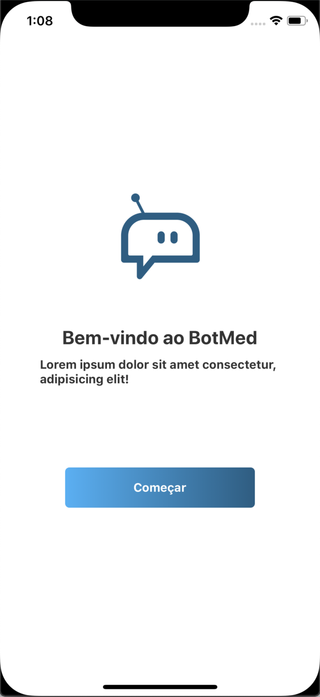
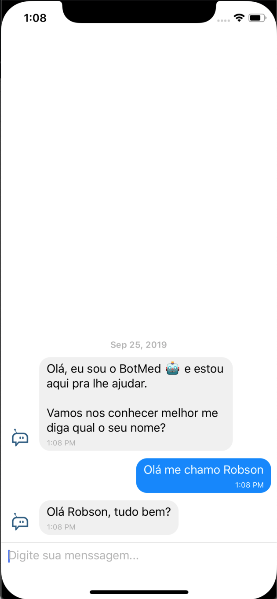

## Chat feito em React Native integrado ao DialogFlow

<p align="center">


</p>

### como rodar o projeto

para instalar o ambiente com o React Native seguir esta [Documentação](https://docs.rocketseat.dev/ambiente-react-native/introducao)

após isso rodar o comando:

```sh
$ react-native run-ios
```

para Ambientes Mac Os

e

```sh
$ react-native run-android
```

para ambiente Linux/Windows
